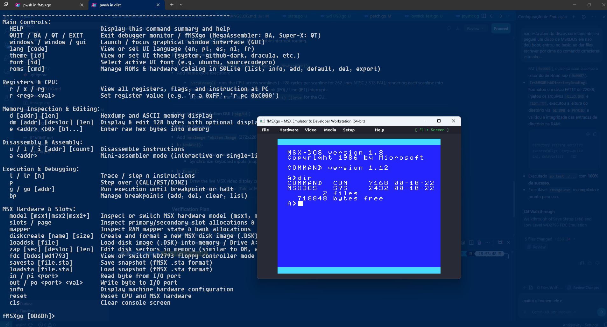
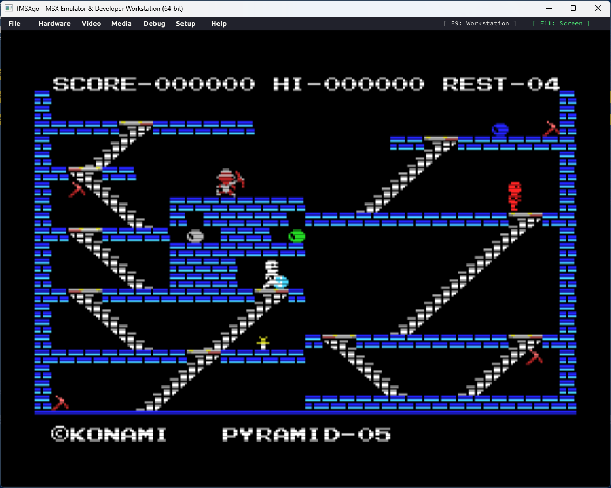

# fMSXgo - MSX Emulator & Developer Workstation (64-bit)

[](https://golang.org)
[]()
[]()
[](LICENSE)

**fMSXgo** is a faithful and modern port of the acclaimed **fMSX** emulator (originally authored in C by **Marat Fayzullin**) to pure **Go (64-bit)**, targeting **Windows and Linux**.


In addition to inheriting the time-tested accuracy of fMSX, **fMSXgo** is designed from the ground up to serve as a **high-end workstation for MSX software developers, hackers, and reverse engineers**, featuring:

* **Pure Go 64-bit Z80 CPU Core**: Cycle-accurate execution, precomputed flag tables (`ZSTable`, `PZSTable`), hardware-verified DAA table, and BIOS patch hook (`ED FE`).
* **Audio Subsystem (PSG, Konami SCC & MSX-MUSIC)**: Cycle-accurate 3-channel AY-3-8910 (PSG) with noise and envelopes, 5-channel Konami SCC / SCC+ wavetable synthesis for MegaROM soundtracks, and Yamaha YM2413 (OPLL/MSX-MUSIC) FM synthesis, mixed to 44.1kHz stereo PCM through a dynamically-sized ring buffer tuned to the real audio backend's read pattern (see [SPEC.md](SPEC.md), section "4.1 Resolved Investigation: PSG/`PLAY` Audio Stutter", for the stutter fix history).
* **Dual FDC Architecture**: Both high-speed BDOS BIOS trap simulation and low-level Western Digital WD2793/WD1793 floppy disk controller emulation for protected disk loaders and custom boot sectors.
* **Save States (.sta)**: 100% binary-compatible snapshots with Marat Fayzullin's fMSX, with GUI hotkeys (F7/F8) and CLI commands (`savesta`/`loadsta`).
* **Joysticks, USB Gamepads & Mouse**: Plug-and-play USB/Bluetooth controller support with keyboard fallback and authentic 4-nibble MSX mouse protocol.
* **Interactive Media Insertion**: Dynamic runtime insertion/ejection of Floppy Disks (`.dsk`), MegaROM Cartridges (`.rom`), and Cassette Tapes (`.cas`) via GUI menus and CLI commands.
* **Built-in Interactive Mini-Assembler**: Assemble Z80 instructions directly into memory at runtime without external toolchains.
* **Dynamic Disassembler**: Disassemble arbitrary memory regions with parameter and length decoding.
* **Accurate Slot Matrix & Memory Management**: 4 Primary Slots (`0xA8`), 4 Secondary Subslots (`0xFFFF`), and a **RAM Mapper** (`0xFC`..`0xFF`) supporting 64KB up to 4MB of RAM.
* **Unified SQLite Persistence (`fmsxgo.db`)**: BIOS ROMs (`MSX.ROM`, `MSX2.ROM`, `MSX2EXT.ROM`, `DISK.ROM`), configuration settings, machine profiles, and documentation are bundled into a single SQLite database (`BLOB` storage), eliminating loose ROM file folders in distribution.
* **Multi-Language UI (i18n)**: Native UI support for **English (default)**, **Portuguese**, **Spanish**, **Dutch**, and **French**. Command names remain standard English (`HELP`, `QUIT`, `lang`, `theme`, `r`, `d`, `a`, `t`), while menus, status dialogs, hints, and command help dynamically reflect the chosen language.
* **11 Modern Color Themes**: Inspired by modern IDEs and editors:
  * **Auto (System OS)**: Automatically tracks OS Dark or Light mode.
  * **GitHub Dark** & **GitHub Light**.
  * **Modern Dark**: **VS Code Dark+**, **Dracula**, **Monokai Pro**, **One Dark Pro**.
  * **Modern Light**: **Solarized Light**, **One Light**.
  * **Simple Dark** & **Simple Light**.
* **Modern Vector Typography & Dynamic Font Subsystem**:
  * High-DPI anti-aliased TrueType/OpenType vector rendering with theme color contrast.
  * **Ubuntu** (Default UI font) and **Source Code Pro** (Monospace hacker font) embedded directly inside the binary.
  * **Zero OS Installation Required**: Drop any `.ttf` or `.otf` font file into `./fonts` or `dist/fonts` and it becomes immediately available in the UI and CLI without installing it into Windows/Linux system fonts.
* **Dual Operating Modes**:
  * **ROM & Hardware Catalog Subsystem (SQLite CRUD)**: Embedded SQLite database (`rom_catalog`) managing BIOS, BASIC, SubROMs, Disk ROMs, and hardware expansions with SHA-1 verification and execution guarantees.
  * **Guaranteed Execution (Garantia de Execução)**: Official standard fMSX ROMs are pre-seeded, verified, and flagged as active defaults with protection against accidental deletion.
  * **Graphical Window (Ebitengine)**: Clean 640x480 interface with top menu bar (`File`, `Media`, `Setup`, `Help`) and live CPU/machine status.
  * **Headless Developer CLI Monitor (`--no-window`)**: Terminal REPL ("Developer OS") with register inspection, hexdump, raw byte editing, instruction stepping (`step-in`, `step-over`), breakpoints, slot visualizer, I/O port testing, and the `roms` suite.
* **Automated Build & Packaging (`build.ps1`)**: Dependency resolution, unit tests, automatic build increment, and self-contained `dist/` creation.

---

## Versioning & Creative Horror / Heavy Metal Codenames

fMSXgo follows strict **`V X.Y.Z`** semantic versioning with creative codenames inspired by classic horror cinema, MSX lore, and heavy metal masterpieces:

* **`Z` (Build)**: Auto-incremented on each compilation by `build.ps1`.
* **`Y` (Feature)**: Incremented upon completing and integrating a functional subsystem.
* **`X` (Major)**: Incremented upon closing a major architectural milestone (e.g. Z80 certification = V 1.0.0).

Current Version: **V 0.3.67 ("Nemesis 2")**

For complete phase tracking and immediate next steps, see [SPEC.md](SPEC.md).

---

## Quick Start

### 1. Build and Package the Distribution
Run the automated build script in PowerShell:
```powershell
.\build.ps1
```
This downloads dependencies, executes all unit tests, compiles the 64-bit binary, seeds `fmsxgo.db` with the verified ROM catalog, and packages a ready-to-run `dist/` folder.

### 2. Run in Graphical Mode (Default)
```powershell
.\fmsxgo.exe
```
Launches the graphical window with the top menu bar (`File`, `Setup`, `Help`).

### 3. Run in Terminal / CLI Developer Mode
```powershell
.\fmsxgo.exe --no-window
```
Or with custom hardware options:
```powershell
.\fmsxgo.exe --no-window -msx2 -ram 8
```

The interactive CLI monitor provides instruction tracing, memory inspection, slot visualization, and an integrated Z80 mini-assembler:


### Command-Line Options & Flags
fMSXgo provides full command-line parity with the original fMSX, plus modern developer workstation extensions:


### 4. ROM & Hardware Catalog (SQLite CRUD)
* **Graphical Mode**: Click `Setup -> ROMs & HW Catalog...` to view all registered ROMs and execution guarantees, and click any ROM to toggle it as the active default.
* **CLI Monitor Mode**:
  * `roms list [category] [model]` - View all catalog ROMs, flags (`[DEF]`, `[VER]`), sizes, and titles.
  * `roms info <name>` - Detailed inspection card with SHA-1 hash and guaranteed execution status.
  * `roms add <file> <cat> <model>` - Import a custom MSX ROM into SQLite.
  * `roms default <name>` - Set active boot default.
  * `roms del <name> [--force]` - Delete custom ROM (system ROMs protected).
  * `roms export <name> <file>` - Export binary BLOB to disk.
  * `roms verify` - Validate SHA-1 checksums and BLOB data integrity.

### 5. Configuration & Preferences (Language, Themes & Typography)
* **Graphical Mode**: Click `Setup -> Configuration...` to open the 3-column modal dialog:
  * **Column 1**: Choose between English, Portuguese, Spanish, Dutch, and French.
  * **Column 2**: Choose from 11 curated modern dark and light color themes.
  * **Column 3**: Choose from embedded typography (**Ubuntu**, **Source Code Pro**) or any custom `.ttf`/`.otf` font dropped into the `fonts/` folder.
  * Live click-to-preview on all elements, then click `[ Save & Close ]`.
* **CLI Monitor Mode**:
  * Type `lang` or `lang <code>` (`en`, `pt`, `es`, `nl`, `fr`).
  * Type `theme` or `theme <id>` (`system`, `github-dark`, `dracula`, `solarized-light`, etc.).
  * Type `font` or `font <id>` (`ubuntu`, `sourcecodepro`, or custom).
* **Startup Flags**:
  * Pass `--lang pt` to start in Portuguese.
  * Pass `--theme dracula` to start with the Dracula theme.
  * Pass `--font ubuntu` or `--font sourcecodepro` to choose typography.

All preferences are automatically persisted in `fmsxgo.db` across sessions.



### Real-World Commercial Software Validation (*King's Valley*)
Beyond synthetic benchmarks and automated test suites, fMSXgo undergoes real-world testing with classic MSX commercial software. During the fine-tuning of the audio and PSG subsystems, Konami's iconic **King's Valley** (MSX1 cartridge) was used in interactive gameplay testing and ran remarkably well:
* **Audio & PSG Validation**: Verified 3-channel tone generation, polynomial noise bursts (jumping, collecting gems, mummies, death sound effects), and confirmed real-time low-latency playback (~100ms) with zero stutter.
* **VDP Display & Proportional Borders**: Displayed with authentic 4-side borders, pixel-perfect 2x integer scaling, and solid 60 FPS / 60 TPS emulation.
* **Interactive Gameplay**: Tight controller responsiveness, authentic sprite rendering, and complete stage progression.



---

## Project Documentation

* 📖 **[MANUAL.md](MANUAL.md)**: Complete user & developer manual, CLI monitor commands, and Mini-Assembler guide.
* 📋 **[SPEC.md](SPEC.md)**: Living engineering specification, milestone checklists, and progress tracker.
* 📝 **[CHANGELOG.md](CHANGELOG.md)**: Chronological history of releases, features, and fixes.

---

## Credits & Licensing

This project is a Go translation and workstation extension of **fMSX**, originally created by **Marat Fayzullin**.

* **Original fMSX Core & Architecture**: &copy; Marat Fayzullin (1994-2021). Developed with the author's knowledge and blessing.
* **Go Port, Developer Tools & Workstation Interface**: &copy; Wilson "Barney" Pilon.
* **AI Pair Programming & Engineering Partners**:
  * **Claude** (Anthropic) &mdash; Deep architectural diagnostics, audio timing synchronization, low-latency buffer tuning, and living documentation engineering.
  * **Antigravity / Gemini** (Google DeepMind) &mdash; Workstation tooling, VDP overscan border subsystems, code generation, refactoring, and integration testing.

**Important Notice**: This project is provided **strictly for Non-Commercial use**, inheriting the non-commercial licensing terms of the original fMSX source code. Please review the [LICENSE](LICENSE) file for complete details.