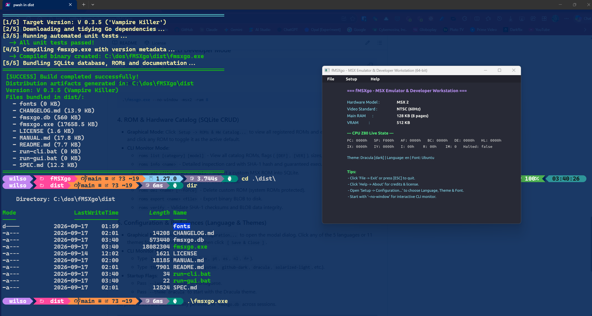
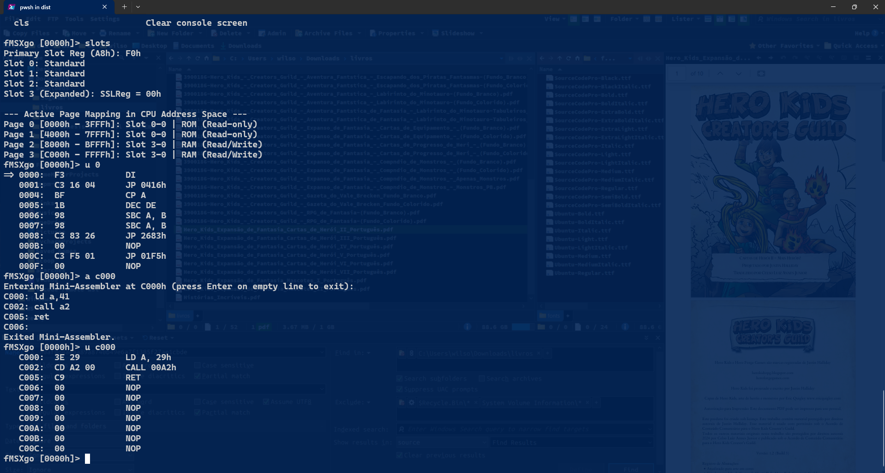
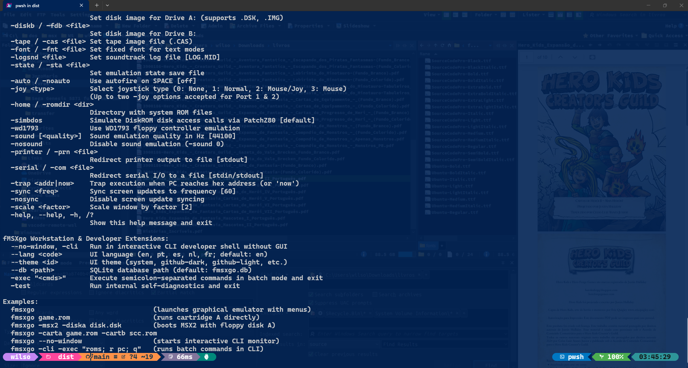

# fMSXgo - Living Engineering Specification (SPEC.md)

> **Living Engineering Document for fMSXgo**
> This document tracks the current project status, milestone history, architectural decisions, completed work, and immediate next steps.

---

## 1. Versioning Scheme & Creative Horror / Heavy Metal Codenames

fMSXgo follows the strict semantic versioning format: **`V X.Y.Z`**

* **`X` (Major)**: Incremented upon closing a major architectural block (e.g. Z80 certification = V 1.0.0; VDP complete = V 2.0.0).
* **`Y` (Minor)**: Incremented upon completing and integrating a functional subsystem (e.g. SQLite storage, multi-language UI, PSG sound chip).
* **`Z` (Build/Patch)**: Incremented on each compilation generated by the automation utility (`build.ps1`).

### Creative Release Codenames (Heavy Metal / Horror / MSX Lore)

| Base Version | Creative Codename | Lore / Inspiration |
| :--- | :--- | :--- |
| **V 0.1.x** | **Phantasm (The Tall Man)** | Don Coscarelli's horror classic / dark and moody atmosphere |
| **V 0.2.x** | **Aleste Nightmare** | Compile's legendary MSX shooter franchise + Nightmare on Elm Street |
| **V 0.3.x** | **Cemetery Gates** | Pantera / gothic atmosphere and heavy riffing |
| **V 0.4.x** | **Evil Dead (Necronomicon)** | Sam Raimi's franchise / conjuring raw machine code |
| **V 0.5.x** | **Iron Maiden (Powerslave)** | Heavy metal pioneer / Egyptian precision of Z80 cycle timing |
| **V 1.0.x** | **Vampire Killer (Dracula's Curse)** | Konami's MSX magnum opus / 1.0 milestone release |

*Current Version:* **V 0.3.3 ("Vampire Killer")**

---

## 2. Project Phases & Milestone Roadmap

### Phase 1.5: 100% fMSX Fidelity Mirror & Patch Subsystems [COMPLETED - 100%]
- [x] **Command-Line Interface 100% Faithful Mirror** (`cmd/fmsxgo/main.go`):
  - [x] Positional argument support: `[filename1] [filename2]` (Cartridge A and Cartridge B).
  - [x] Full set of official fMSX options matching `Help.h` and `fMSX.c`: `-verbose <level>`, `-skip <percent>`, `-pal`/`-ntsc`, `-msx1`/`-msx2`/`-msx2+`, `-ram <pages>`, `-vram <pages>`, `-rom <type|file>`, `-carta <file>`, `-cartb <file>`, `-diska`/`-fda <file>`, `-diskb`/`-fdb <file>`, `-tape`/`-cas <file>`, `-font`/`-fnt <file>`, `-logsnd <file>`, `-state`/`-sta <file>`, `-auto`/`-noauto`, `-joy <type>`, `-home`/`-romdir <dir>`, `-simbdos`/`-wd1793`, `-sound [<qual>]`/`-nosound`, `-printer`/`-prn <file>`, `-serial`/`-com <file>`, `-trap <addr|now>`, `-sync <freq>`/`-nosync`, `-scale <factor>`, `-help`.
  - [x] Preserved fMSXgo enhancements: `--no-window`/`-cli`, `--lang <code>`, `--theme <id>`, `--db <path>`, `-exec "<cmds>"`, `-test`.
- [x] **BIOS & DiskROM BDOS Patches Subsystem (`PatchZ80`)** (`pkg/msx/patch.go`):
  - [x] Faithful pure Go port of Marat Fayzullin's `Patch.c`.
  - [x] Intercept vector `0xED, 0xFE, 0xC9` installed at official addresses.
  - [x] BDOS disk access calls: `0x4010` (PHYDIO - physical sector read/write with slot switching to RAM and back), `0x4013` (DSKCHG), `0x4016` (GETDPB - Drive Parameter Block extraction), `0x401C` (DSKFMT - disk formatting with 512-byte MSX boot sector `BootBlock`), `0x401F` (DRVOFF).
  - [x] Virtual Floppy Drives A: and B: (`FloppyDrive`) supporting 360KB, 720KB, 640KB, 1280KB `.DSK` disk images.
  - [x] BIOS cassette tape calls: `0x00E1` (TAPION), `0x00E4` (TAPIN), `0x00E7` (TAPIOF), `0x00EA` (TAPOON), `0x00ED` (TAPOUT), `0x00F0` (TAPOOF), `0x00F3` (STMOTR) with virtual Tape Drive (`TapeDrive`) supporting `.CAS` files.
- [x] **Core CPU & Bus Defect Fixes & Behavioral Verification**:
  - [x] Z80 `Reset()`: zeros all 8-bit registers (`A`, `F`, `B`, `C`, `D`, `E`, `H`, `L`, alternate set) and sets `SP = 0xF000` (matching `ResetZ80()` in `Z80.c`).
  - [x] Z80 `DAA`: uses 2048-word precomputed `DAATable` from `Tables.h` for 100% bit-exact flag handling.
  - [x] Z80 `LD A, I` & `LD A, R`: P/V flag reflects `IFF2` without spurious parity bits.
  - [x] Z80 `OUTI`, `OTIR`, `OUTD`, `OTDR`: register `B` decremented before driving address bus to output port.
  - [x] MSX Bus `Write`: verifies write permission per 8KB bank (`IsRAM[psl][ssl][page8k]`), preventing ROM corruption in mixed pages.
  - [x] MSX Bus PPI Port `0xAB`: supports Intel 8255 Bit Set/Reset operation on Port C (`0xAA` - KeyRow / clicker / CAPS LED / cassette).
  - [x] MSX Bus Secondary Slot Register (`0xFFFF`): only intercepted if primary slot in Page 3 is expanded (`IsSubslot[psl]`), allowing unexpanded RAM/ROM in Page 3 to access `0xFFFF`.

### Phase 1: System Foundation, Workstation Architecture & i18n [COMPLETED - 100%]
- [x] Pure Go 64-bit module setup (`fmsxgo`).
- [x] Faithful Zilog Z80 processor emulation (Base, CB, ED, DD, FD, DDCB, and FDCB opcode matrices; cycle counting; precomputed flag tables `ZSTable` and `PZSTable`).
- [x] BIOS intercept and acceleration hook opcode `ED FE` (`PatchZ80`).
- [x] Dynamic real-time Z80 disassembler (`pkg/cpu/z80/disasm.go`).
- [x] Built-in interactive Mini-Assembler (`pkg/cpu/z80/miniasm.go`), assembling instructions directly into memory at runtime.
- [x] Full MSX slot bus architecture: 4 Primary Slots (`0xA8`), 4 Secondary Subslots (`0xFFFF`), 8KB/16KB page routing.
- [x] RAM Mapper implementation (ports `0xFC`..`0xFF`, supporting 64KB to 4MB).
- [x] Memory write-protection for ROM vs RAM pages based on mapped slot attributes.
- [x] Unified SQLite Persistence (`pkg/storage/db.go`):
  - [x] Schema: `rom_catalog`, `roms`, `config`, `manuals`, `machine_profiles`.
  - [x] Direct BIOS ROM loading from SQLite `BLOB` storage, removing loose ROM folders.
  - [x] Automatic database seeding from `third-party/fMSX/ROMs`.
- [x] **ROMs & Hardware Catalog Subsystem (SQLite CRUD)** (`pkg/storage`, `pkg/msx`, `pkg/shell`, `pkg/ui`):
  - [x] Relational table `rom_catalog` supporting categories (`bios`, `basic`, `subrom`, `disk`, `hardware`, `cartridge`), models (`MSX1`, `MSX2`, `MSX2+`, `ALL`), SHA-1 checksums, and BLOB binaries.
  - [x] Official standard fMSX ROMs flagged as **Defaults** and **Guaranteed Execution** (`is_default = 1`, `is_verified = 1`).
  - [x] Accidental deletion protection on official verified default system ROMs unless `--force` is given.
  - [x] Single-default constraint per category & model slot automatically enforced.
  - [x] Dynamic runtime boot resolution via `ROMManager.LoadDefaultROM(category, model)`.
  - [x] Developer CLI suite: `roms list`, `roms info`, `roms add`, `roms default`, `roms del`, `roms export`, `roms verify`.
  - [x] Graphical UI Catalog Selector modal dialog under `Setup -> ROMs & HW Catalog...` with click-to-default toggling.
- [x] Multi-Language UI (i18n) Subsystem (`pkg/i18n`):
  - [x] Full translation dictionaries for 5 languages: English (`en`, default), Portuguese (`pt`), Spanish (`es`), Dutch (`nl`), and French (`fr`) (Japanese deferred for now).
  - [x] Dynamic runtime switching with thread-safe getters and setters.
  - [x] Persistent language preference saved in `fmsxgo.db`.
  - [x] CLI flag `--lang <code>` and CLI monitor command `lang <code>`.
- [x] Modern Theme Subsystem (`pkg/ui/theme`):
  - [x] 11 curated color themes: Auto (System OS), GitHub Dark, GitHub Light, VS Code Dark+, Dracula, Monokai Pro, One Dark Pro, Solarized Light, One Light, Simple Dark, Simple Light.
  - [x] Windows Registry OS Theme Auto-Detection (`AppsUseLightTheme`).
  - [x] Real-time live dynamic UI reskinning without restart.
  - [x] CLI flag `--theme <id>` and monitor command `theme <id>`.
  - [x] SQLite database persistence under `config` table (`theme`).
- [x] **Modern Typography & Dynamic Font Subsystem** (`pkg/ui/font`):
  - [x] High-DPI anti-aliased TrueType/OpenType vector text rendering via Ebitengine text/v2 (`GoTextFace`).
  - [x] Embedded zero-dependency fonts: **Ubuntu** (Default UI font) & **Source Code Pro** (Monospace code font).
  - [x] Dynamic filesystem scanning: loads external `.ttf`/`.otf` files from `fonts/`, `dist/fonts/`, or `third-party/fonts/` with zero OS installation required.
  - [x] CLI flag `--font <id>` and developer CLI monitor command `font [id]`.
  - [x] Three-column configuration modal in GUI (`Setup -> Configuration...`) with real-time preview and SQLite persistence (`config.font`).
  - [x] Complete theme color harmonization: crisp dark text on light themes, vibrant text on dark themes.
- [x] Graphical User Interface (`pkg/ui/gui.go`):
  - [x] Cross-platform 640x480 window using pure Go Ebitengine (no CGO/GCC requirement on Windows).
  - [x] Top menu bar:
    - [x] `File`: `Reset Machine`, `Exit`.
    - [x] `Setup`: `Configuration...` (Language, Theme & Typography), `ROMs & HW Catalog...` (Catalog Manager).
    - [x] `Help`: `About fMSXgo` modal credits and non-commercial license dialog.
  - [x] Live machine configuration and CPU register state overlay.
- [x] Interactive Developer Shell / CLI Monitor (`pkg/shell/cli.go`):
  - [x] Headless terminal mode via `--no-window` and `-cli`.
  - [x] Commands: `HELP`, `QUIT`, `lang`, `theme`, `font`, `roms`, `r` (registers), `d` (hexdump), `e` (memory byte edit), `u` (disasm), `a` (mini-assembler), `t` (trace), `p` (step-over), `g` (run), `bp` (breakpoints), `slots`, `mapper`, `in`, `out`, `reset`, `cls`.
  - [x] Localized help and banner messages based on active language while keeping command names in standard English.
- [x] Automation & Build Tooling (`build.ps1`):
  - [x] Resolves dependencies, auto-increments build number `Z` in `version.json`.
  - [x] Runs unit tests, compiles 64-bit binary, seeds `fmsxgo.db`, copies manuals, and generates `dist/`.

---

### Phase 2: VDP Video Processor (TMS9918 / V9938 / V9958) [NEXT UP]
- [ ] VDP control registers (0..63) and status registers (0..15).
- [ ] VRAM allocation: 128KB video memory and page buffers.
- [ ] Scanline-by-scanline rendering engine (`RefreshLine0` to `RefreshLine12`):
  - [ ] SCREEN 0: Text 40 and 80 columns, color attributes, and blink.
  - [ ] SCREEN 1 and 2: Graphic modes for MSX1.
  - [ ] SCREEN 3: Multicolor mode.
  - [ ] SCREEN 4, 5, 6, 7, 8: MSX2 bitmap graphic modes with RGB palette.
  - [ ] SCREEN 10, 11, 12: MSX2+ YJK/YAE graphic modes.
- [ ] Sprite Generation Engine:
  - [ ] Mode 1 Sprites (TMS9918: 32 sprites, 4 per scanline, collision detection).
  - [ ] Mode 2 Sprites (V9938/V9958: 32 sprites, 8 per scanline, multi-color per line, CC attribute, priority).
- [ ] Hardware Accelerated VDP Commands:
  - [ ] `HMMC`, `LMMC`, `LINE`, `HMMM`, `YMMM`, `LMMM`, `LMMV`, `HMMV`, `PSET`, `POINT`, `SRCH`.
- [ ] Vertical and horizontal sync: IE0 (VBlank) and IE1 (Line coincidence) interrupts.

---

### Phase 3: Audio Subsystem [PENDING]
- [ ] **AY-3-8910 / YM2149 (PSG)**: 3 square-wave channels, pseudo-random noise generator, envelope generator, and joystick ports.
- [ ] **Yamaha YM2413 (OPLL / MSX-MUSIC)**: 9-channel FM synthesizer (or 6 melody + 5 rhythm channels).
- [ ] **Konami SCC / SCC+**: 5-channel custom wavetable synthesizer.
- [ ] **Audio Mixer**: Low-latency 44.1kHz/48kHz PCM stereo stream piped into Ebitengine's audio driver.

---

### Phase 4: Disk, Cassette & Peripheral Controllers [PENDING]
- [ ] **Western Digital WD1793**: Complete floppy disk controller emulation.
- [ ] **Disk Image Support**: Reading and writing `.DSK` (720KB / 360KB) and `.FDI` files.
- [ ] **Cassette / Tape**: Audio stream and `.CAS` file load/save.
- [ ] **Keyboard & Joysticks**: Matrix mapping for PPI 8255 (US, Japanese, and Brazilian ABNT2 layouts).

---

### Phase 5: Advanced Developer / Hacker Workstation Tools [PENDING]
- [ ] **Interactive Visual Debugger**:
  - [ ] Conditional breakpoints (PC address, memory read/write, I/O ports, scanline).
  - [ ] Circular execution history (Time-Travel / Trace Buffer for the last 10,000 instructions).
  - [ ] Symbol and label table import (`.sym`, `.map`, pasmo, asMSX, glass).
- [ ] **Visual Memory Map & Slot Inspector Window**.
- [ ] **VRAM & Tile / Sprite Viewer**.
- [ ] **Integrated Hex Editor & Live Memory Patcher**.

---

## 3. Visual Verification & Workstation Showcase

### Graphical Workstation & Build Automation
The graphical user interface integrates dynamic theme styling (Dracula, GitHub Light/Dark, etc.), vector typography with anti-aliasing (Ubuntu default, Source Code Pro), and automated distribution bundling via `build.ps1`:

### Developer CLI Monitor, Debugger & Built-in Mini-Assembler
Headless and terminal-based developers have access to full slot bus inspection (`slots`), live disassembly (`u`), and runtime machine code assembly directly into memory (`a`):

### 100% fMSX Mirror Fidelity & Command-Line Help
Every official fMSX parameter (`-verbose`, `-msx1/-msx2`, `-diska/-diskb`, `-rom`, `-sound`, etc.) is fully supported alongside fMSXgo enhancements:

---

## 4. Progress Tracking & Next Direct Steps

* **Where we are**:
  - Phase 1, Phase 1.5, Setup/Catalog CRUD, and Typography subsystems are **100% complete**: Z80 core, MSX bus, slot architecture, RAM mapper, SQLite single-file persistence, Setup ROM & Hardware Catalog CRUD with execution guarantees, 5-language i18n subsystem, 11 modern themes, TrueType vector typography with zero OS installation, graphical menus with setup dialogs, 100% faithful fMSX command line mirror, and interactive CLI developer shell.
* **Immediate Next Step**:
  - Begin **Phase 2 (VDP Video Processor)**: Implement TMS9918/V9938 registers, VRAM bus access, and character/bitmap scanline renderers to display live MSX output in the graphical window.

